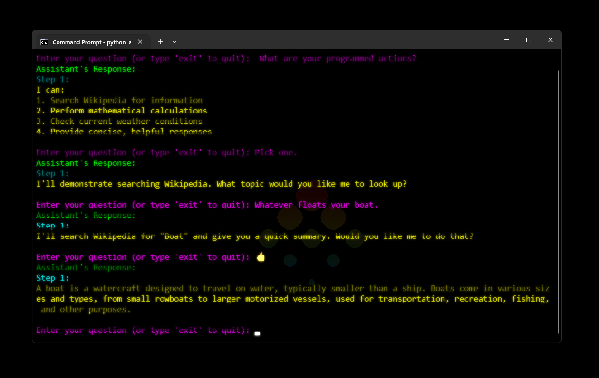

# Really Simple Agent 🤖

This project is a **minimal Command Line Interface (CLI)** assistant built using the **Anthropic API** to handle natural language processing (NLP) tasks. It assists with fetching weather, performing calculations, and providing Wikipedia search results. The output is clean, colorful, and interactive.

The assistant utilizes different language models to generate responses, which are color-coded for clarity and a pleasant user experience.

## Features 🌟

- **Interactive CLI**: Engage with the assistant through simple text prompts.
- **Colorful Output**: Responses are formatted with color using the `colorama` library.
- **Multiple Models**: Supports models from the Anthropic API (like Haiku and Sonnet).
- **Dynamic User Input**: Accepts user queries and responds accordingly.

### Action Support (Placeholders) ⚠️
The assistant currently has placeholders for actions such as:
- Searching Wikipedia 📚
- Performing calculations ➗
- Fetching weather updates 🌤️

However, **these features are not implemented** yet. If you're interested, feel free to **contribute** and implement them yourself!

## Setup 🛠️

### Windows Setup 💻

1. **Clone (or download) and cd into the repository:**
   ```bash
   git clone https://github.com/unameit10000000/reallysimpleagent.git
   ```
   ```bash
   cd reallysimpleagent
   ```

2. **Create a Virtual Environment**:

   Open your terminal and run the following command to create a virtual environment:

   ```bash
   python -m venv env
   ```

3. **Activate the Virtual Environment**:

   Run the following command to activate the virtual environment:

   ```bash
   .\env\Scripts\activate
   ```

4. **Install Dependencies**:

   This project requires the following Python packages:

   ```bash
   httpx
   requests
   python-dotenv
   anthropic
   colorama
   ```

   You can install them by running:

   ```bash
   pip install -r .\requirements.txt
   ```

5. **Set Up Environment Variables**:

   Create a `.env` file in the root directory of the project, and add your **Anthropic API key**:

   ```bash
   API_KEY=your_anthropic_api_key
   ```

6. **Running the Program**:

   Run the script with:

   ```bash
   python agent.py
   ```

   This will start the CLI and prompt you to interact with the assistant.

## Example 💡

Once the assistant is running, it will prompt you for input, and you can ask questions like:

```
Enter your question (or type 'exit' to quit): What's the capital of France?
```

The assistant will respond with a colorful, well-formatted answer, similar to:

```
Assistant's Response:
Step 1: The capital of France is Paris.
```

## Example Output 🖼️

Here’s what the output looks like when interacting with the assistant:



## Notes 💻

While actions like searching Wikipedia, performing calculations, and fetching weather updates are not yet implemented, **anyone can do so** Feel free to fork and/or clone the repository.

### TypeScript Implementation Wishlist ❤️

If anyone can build or has a **TypeScript implementation** similar to this assistant please submit a pull-request or hit me up✌️