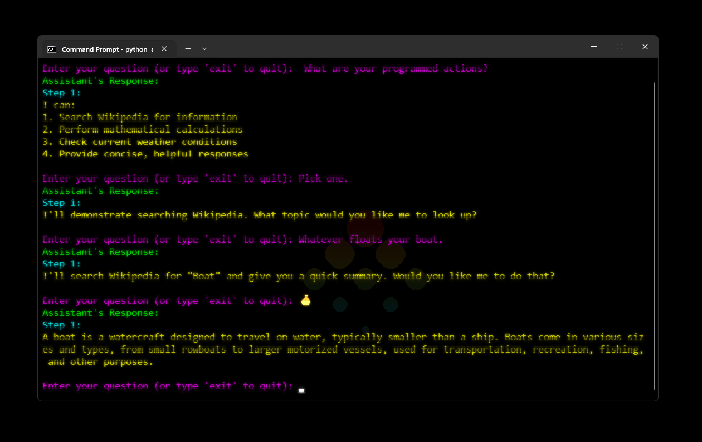
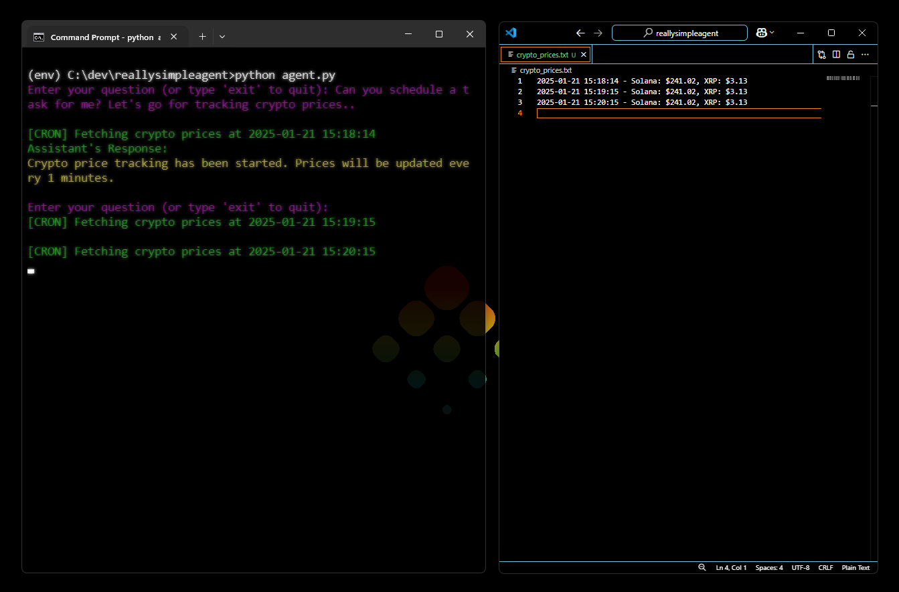

<div align="center">
  
  <h1>Really Simple Agent</h1>
  <p>Really simple AI Agent boilerplate code</p>
</div>

This is an extremely basic and minimal ***command line interface (CLI)*** **AI Agent** built using the **Anthropic API** to perform tasks.

## 💻 | Example Output 

What the Basic CLI output looks like:



Automated task feature in action:



## 🔤 | About
Currently the tracking of cryptocurrency prices is supported, however there are placeholders for fetching weather, performing calculations and providing Wikipedia search results, both which have yet to be implemented. (feel free to fork and submit a PR) Furthermore the Agent CLI provides a interactive chat, similar to ChatGPT and different language models are supported. (Haiku, Sonnet). Additionally, the agent now uses AI-driven command interpretation instead of keyword matching, making it a bit more 'intelligent'.

## 🌟 | Features and Actions 
- **Interactive CLI**: Engage with the assistant through simple text prompts.
- **Colorful Output**: Responses are formatted with color using the `colorama` library.
- **Multiple Models**: Supports models from the Anthropic API (like Haiku and Sonnet).
- **Dynamic User Input**: Accepts user queries and responds accordingly.
- **Cryptocurrency Price Tracking**: Automated price tracking for crypto.
- **Scheduled Tasks**: Background task scheduling for continuous price monitoring.

### Action Support (Placeholders)
The assistant currently has placeholders for actions such as:
- Searching Wikipedia 📚
- Performing calculations ➗
- Fetching weather updates 🌤️

## 🛠️ | Setup

### Windows Setup 
1. **Clone (or download) and cd into the repository:**
   ```bash
   git clone https://github.com/unameit10000000/reallysimpleagent.git
   ```
   ```bash
   cd reallysimpleagent
   ```

2. **Create a Virtual Environment**:

   Open your terminal and run the following command to create a virtual environment:

   ```bash
   python -m venv env
   ```

3. **Activate the Virtual Environment**:

   Run the following command to activate the virtual environment:

   ```bash
   .\env\Scripts\activate
   ```

4. **Install Dependencies**:

   ```bash
   pip install -r .\requirements.txt
   ```

5. **Set Up Environment Variables**:

   Create a `.env` file in the root directory of the project, and add your **Anthropic API key**:

   ```bash
   API_KEY=your_anthropic_api_key
   ```

6. **Running the Program**:

   Run the script with:

   ```bash
   python agent.py
   ```

   This will start the CLI and prompt you to interact with the assistant.

## 💡| Example Usage 

### Basic Interaction
```
Enter your question (or type 'exit' to quit): What's the capital of France?
```

The assistant will respond with a colorful, well-formatted answer:

```
Assistant's Response:
Step 1: The capital of France is Paris.
```

### Cryptocurrency Tracking
```
Enter your question (or type 'exit' to quit): Can you track crypto prices for me?
```

The assistant will start tracking cryptocurrency prices and show:

```
Assistant's Response:
Crypto price tracking has been started. Prices will be updated every 5 minutes.

[CRON] Fetching crypto prices at 2024-03-14 15:30:00
```

## ❤️ | Contributions 
- **TypeScript Implementation:** If anyone can build or has a typeScript implementation similar to this assistant please submit a pull-request or hit me up.
- **Bugs:** Please let me know if you encounter bugs and/or something is wrong.✌️

## ✅ | Latest updates
### 0.1
- Improved system prompt with detailed command structure
- Split actions into automated and one-time tasks
- Implemented AI-driven command interpretation
- Added welcome message with available commands
- Enhanced error handling and response formatting
- Expanded cryptocurrency tracking capabilities

### 0.0
- Added cryptocurrency price tracking functionality
- Implemented automated scheduling system
- Added real-time console notifications for scheduled tasks
- Integrated price data logging to file system
